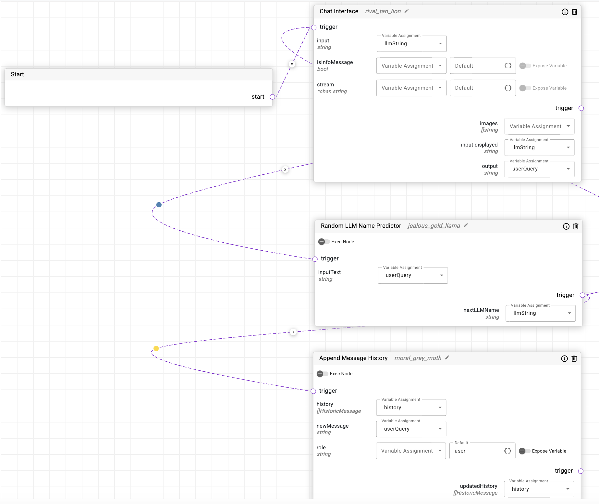
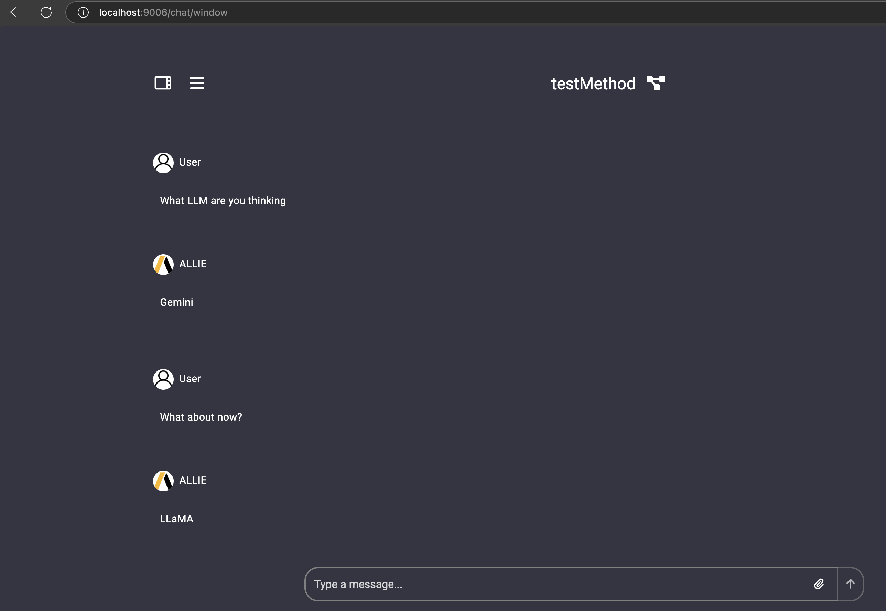

# Adding New Functions, Types, and Categories

## 1. Adding a New Function

### Step 1: Define the Function
Define the new function in the appropriate package. If you were adding a function related to data extraction, you would need to add it to the `data_extraction` package. Ensure the inclusion of `displayName` as that's what you'll see on the UI interface to pick the method.

____________________

Example:
```go
// File: aali-flowkit/pkg/externalfunctions/data_extraction.go
package externalfunctions

// TransformData processes input data and returns a transformed result.
// Tags:
//   - @displayName: Transform the Data
// . . .
func TransformData(dataform string, depth int) (transformed string, err error) {
    // Function implementation
    return "transformed_data", nil
}
```

### Step 2: Incorperate the Function
Add the newly defined function to the `externalfunctions.go` file. Any newer functions unrelated to an existing file within `externalfunctions/` can be created and incorperated if necessary.

Now, we **must** add this newly defined method to externalfunctions.

Example (continued):
```go
// File: aali-flowkit/pkg/externalfunctions/externalfunctions.go
var ExternalFunctionsMap = map[string]interface{}{
    // llm handler
    "PerformVectorEmbeddingRequest":                                   PerformVectorEmbeddingRequest,
    // . . .

    // data extraction
    "GetGithubFilesToExtract":                    GetGithubFilesToExtract,
    "GetLocalFilesToExtract":                     GetLocalFilesToExtract,
    "AppendStringSlices":                         AppendStringSlices,
    "DownloadGithubFileContent":                  DownloadGithubFileContent,
    "GetLocalFileContent":                        GetLocalFileContent,
    "GetDocumentType":                            GetDocumentType,
    "LangchainSplitter":                          LangchainSplitter,
    "GenerateDocumentTree":                       GenerateDocumentTree,
    "AddDataRequest":                             AddDataRequest,
    "CreateCollectionRequest":                    CreateCollectionRequest,
    "CreateGeneralDataExtractionDocumentObjects": CreateGeneralDataExtractionDocumentObjects,
    "TransformData":                              TransformData, // New function added here

    // CONTINUED
}
```

## 2. Adding a New Type

### Step 1: Define the Type
Define your new type in the appropriate package within `types.go`.

Example:
```go
// File: aali-flowkit/pkg/externalfunctions/types.go

package externalfunctions

// RLAgent is an reinforcement learning agent :O
type RLAgent struct {
    Critique string
    Reward float64
}
```
### Step 2: Include the Type
Incorperate the new type into its respective location in `aali-sharedtypes` repo.

Example:
```go
// File: aali-sharedtypes/pkg/sharedtypes/dataextraction.go

package externalfunctions

// RLAgent is an reinforcement learning agent :O
type RLAgent struct {
    Critique string         `json:"critique"`
    Reward float64          `json:"reward"`
}
```
### Step 3: Configure the Type
Now you must make the changes in the `aali-agent-configurator` repo.

Example:
```ts
// File: aali-agent-configurator/src/app/constants/constants.ts

import { MatTooltipDefaultOptions } from "@angular/material/tooltip";
// CONTINUED
export const goTypes: string[] = [
    "string",
    "bool",
    "int",
    "uint32",
    "float32",
    "float64",
    "interface{}",
    "[]string",
    "[]bool",
    "[]byte",
    "[]int",
    "[]float32",
    "[]float64",
    "[]interface{}",
    "[][]float32",
    "map[string]string",
    "map[string]bool",
    "map[string]int",
    "map[string]float32",
    "map[string]float64",
    "map[string][]string",
    "[]map[string]string",
    "[]map[uint]float32",
    "[]map[string]interface{}",
    "*chan string",
    "*chan interface{}",
    "DbArrayFilter",
    "DbFilters",
    "[]ACSSearchResponse",
    "[]AnsysGPTCitation",
    "[]DbJsonFilter",
    "[]DbResponse",
    "[]AnsysGPTDefaultFields",
    "[]HistoricMessage",
    "[]DbData",
    "[]CodeGenerationElement",
    "[]CodeGenerationExample",
    "[]CodeGenerationUserGuideSection"
    "[]RLAgent" // added new type here
  ]
  // . . .
```

### Step 4: Update Type Checking
When adding a type, you must ensure it's registered and convertible in `aali-sharedtypes`. Specifically, for the `ConvertStringToGivenType` and `ConvertGivenTypeToString` functions.

Example:
```go
// File: aali-sharedtypes/pkg/typeconverters/typeconverters.go

package typeconverters

import (
	"encoding/json"
	"fmt"
	"strconv"
	"strings"

	"github.com/ansys/aali-sharedtypes/pkg/sharedtypes"
)
// . . .
func ConvertStringToGivenType(value string, goType string) (output interface{}, err error) {
	defer func() {
		r := recover()
		if r != nil {
			err = fmt.Errorf("panic occured in convertStringToGivenType: %v", r)
		}
	}()

	switch goType {
    // . . .
    case "RLAgent":
        if value == "" {
            value = "{}"
        }
        output := sharedtypes.RLAgent{}
        err := json.Unmarshal([]byte(value), &output)
        if err != nil {
            return nil, err
        }
        return output, nil
    }
func ConvertGivenTypeToString(value interface{}, goType string) (output string, err error) {
	defer func() {
		r := recover()
		if r != nil {
			err = fmt.Errorf("panic occured in ConvertGivenTypeToString: %v", r)
		}
	}()

	switch goType {
    case "RLAgent":
        output, err := json.Marshal(value.(sharedtypes.RLAgent))
        if err != nil {
            return "", err
        }
        return string(output), nil
    }
// CONTINUED
```


## 3. Adding a New Category

### Step 1: Make a New Category File

In the `pkg/externalfunctions/` directory, if necessary, make an entirely new Go file for your function(s), e.g., `sft.go`. Ensure to adhere to previous sections to add newly defined functions and types with a new category.

### Step 2: Update the Main File

Update the `main.go` file to include the new category (if necessary) with the corresponding file.

Example:
```go
// File: aali-flowkit/main.go

func main() {
    // . . .

    //go:embed pkg/externalfunctions/milvus.go
    var sftFile string // add the string declaration

    // . . .

    // Create file list
    files := map[string]string{
        "data_extraction":  dataExtractionFile,
        "generic":          genericFile,
        "knowledge_db":     knowledgeDBFile,
        "llm_handler":      llmHandlerFile,
        "ansys_gpt":        ansysGPTFile,
        "milvus":           milvusFile,
        "ansys_mesh_pilot": ansysMeshPilotFile,
        "auth":             authFile,
        "sft":              sftFile, // Add the new category file here
    }

    // CONTINUED
}
```
### Step 3: Update the Agent Config
Update the `aali-agent-configurator` to include the new category (if necessary) with the corresponding name, same constants file as the type

Example:
```ts
// File: aali-agent-configurator/src/app/constants/constants.ts

import { MatTooltipDefaultOptions } from "@angular/material/tooltip";
// CONTINUED
export const functionCategories = {
    "llm_handler": "LLM",
    "knowledge_db": "Database",
    "milvus": "Milvus",
    "ansys_gpt": "Ansys GPT",
    "data_extraction": "Data Extraction",
    "generic": "Generic",
    "ansys_mesh_pilot": "Ansys Mesh Pilot",
    "auth": "Auth",
    "sft":"Sft", // added new cateogry here
};
```

## Testing Tutorial
### 1. Adding a function
Using the guide from earlier, let's simply add a function to `generic.go` for the sake of testing. It will simply output a random name from a set of names, in this case LLMs!

```go
// File: aali-flowkit/pkg/externalfunctions/generic.go

// RandomLLMNamePredictor predicts a random LLM name based on the input text.
//
// Tags:
// - @displayName: Random LLM Name Predictor
//
// Parameters:
// - inputText: the input text to trigger the random LLM name prediction
// Returns:
// - nextLLMName: the predicted random LLM name
func RandomLLMNamePredictor(inputText string) (nextLLMName string) {
    logging.Log.Infof(&logging.ContextMap{}, "IN RANDOM LLM NAME PREDICTOR.")
    fmt.Println("PRINT - IN RANDOM LLM NAME PREDICTOR")

    // List of fictional LLM names
    llmNames := []string{
        "Gemma",
        "Gemini",
        "ChatGPT",
        "BERT",
        "Phi",
        "Claude",
        "LLaMA",
        "Deepseek",
    }

    // Select a random LLM name from the list
    nextLLMName = llmNames[rand.Intn(len(llmNames))]

    // Log and print the selected random LLM name
    logging.Log.Infof(&logging.ContextMap{}, "Predicted random LLM name: %s", nextLLMName)
    fmt.Println("PRINT - Predicted random LLM name:", nextLLMName)

    return nextLLMName
```

### 2. Registering the function
Add the newly defined function to the `externalfunctions.go` file. Any newer functions unrelated to an existing file within `externalfunctions/` can be created and incorperated if necessary.

Now, we **must** add this newly defined method to externalfunctions.

Example (continued):
```go
// File: aali-flowkit/pkg/externalfunctions/externalfunctions.go

var ExternalFunctionsMap = map[string]interface{}{
    // llm handler
    "PerformVectorEmbeddingRequest":                                   PerformVectorEmbeddingRequest,
    // . . .

    // generic
    "AssignStringToString":   AssignStringToString,
    "SendRestAPICall":        SendRestAPICall,
    "RandomLLMNamePredictor": RandomLLMNamePredictor, // New function added here

    // CONTINUED
}
```

### 3. Build a quick flow in Aali-Chat
Below is an easy demonstration on how to visualize and verify both the method's availability as well as the output in a simple workflow. Use port 9008 on localhost to develop a workflow, and localhost 9006 to chat with a selected workflow!


